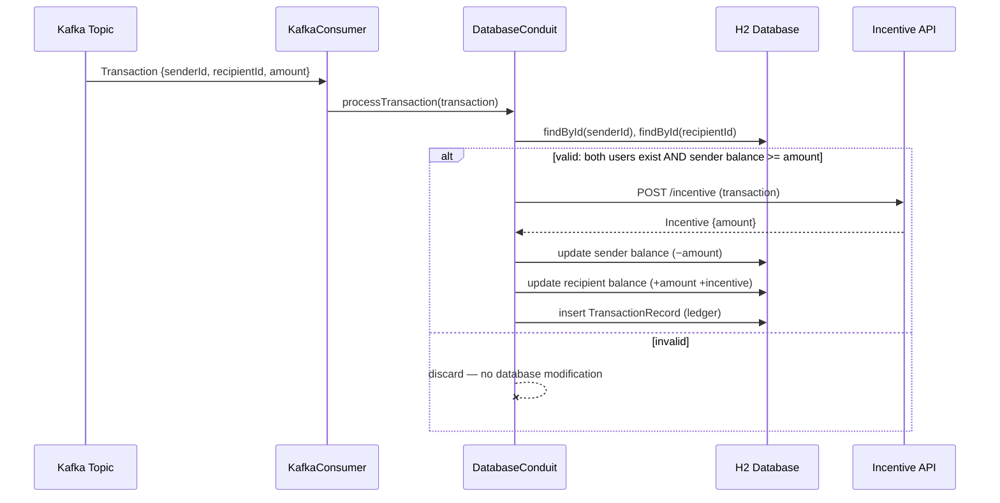

# Midas Transaction Processor

An event-driven banking microservice built with Spring Boot. Midas consumes payment
transactions from a Kafka topic, validates them against user accounts, applies atomic
balance transfers, records every valid transaction to a persistent ledger, enriches
transactions with bonuses from an external incentive REST API, and exposes account
balances through a REST endpoint.

Built as part of JPMorgan Chase's Advanced Software Engineering program (Forage),
extended beyond the program scaffold.

**Tech:** Java 17 · Spring Boot 3.4 · Spring Kafka · Spring Data JPA (Hibernate) · H2 · Maven

---


## Transaction Flow



## What Happens to a Transaction

A transaction is **valid** only if the sender exists, the recipient exists, and the
sender's balance covers the amount. Valid transactions atomically debit the sender,
credit the recipient (plus any incentive awarded by the external API), and append an
immutable `TransactionRecord` to the ledger with `@ManyToOne` relationships to both
users. Invalid transactions are discarded with zero database modification.

## Implementation Highlights

- **Kafka consumer** — `@KafkaListener` with externalized topic configuration
  (`${general.kafka-topic}`), JSON deserialization into typed `Transaction` objects
  via Jackson with trusted-package constraints
- **Layered architecture** — thin listener delegates to `DatabaseConduit`
  (single gateway for all persistence), which delegates HTTP concerns to a dedicated
  incentive client component; all wiring via constructor injection
- **JPA data model** — `UserRecord` and `TransactionRecord` entities with
  auto-generated schema; ledger rows reference users through foreign keys rather
  than duplicating data
- **External REST integration** — `RestTemplate` (registered as a `@Bean`) posts each
  valid transaction to the incentive service and deserializes the JSON response
- **REST API** — `GET /balance?userId={id}` returns a JSON `Balance`; unknown users
  safely return a zero balance
- **Testing** — verified end-to-end with embedded Kafka integration tests
  (`@EmbeddedKafka`) against an in-memory H2 database

## Project Structure

```
src/main/java/com/jpmc/midascore/
├── component/       # Spring-managed workers (listener, conduit, API client, controller)
├── entity/          # JPA entities → database tables (UserRecord, TransactionRecord)
├── foundation/      # JSON message shapes (Transaction, Balance, Incentive)
├── repository/      # Spring Data repositories (generated implementations)
└── MidasCoreApplication.java
```

## Running

```bash
# 1. Start the incentive API (separate terminal)
java -jar services/transaction-incentive-api.jar --server.port=8081

# 2. Run the test suite (starts embedded Kafka + H2, streams test transactions)
./mvnw test

# The REST API serves on port 33400 while the application is running:
curl "http://localhost:33400/balance?userId=1"
```

## Attribution

Scaffold provided by JPMorgan Chase's [Advanced Software Engineering program on
Forage](https://www.theforage.com/). All consumer logic, validation, persistence,
entity modeling, REST integration, and the balance API were implemented on top of it.
